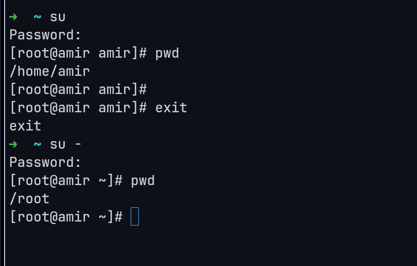
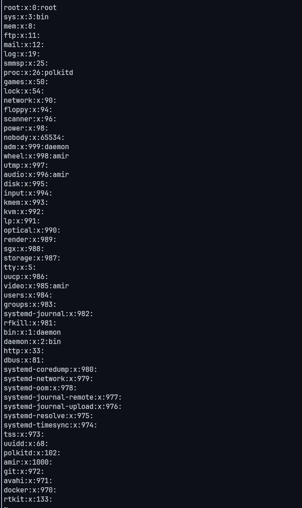

# Tugas Administrasi Jaringan

## Apa perbedaan su dan su-

1. su : singkatan dari switchuser atau superuser. Dan digunakan untuk beralih akun ke User lain atau akun SuperUser. Jika su tanpa argumen tambahan, itu adalah beralih ke superUser.

2. su - : perintah ini memiliki efek yang sama dengan su sebelumnya. Namun, jika menggunakan su - akan mengganti path workspace ke superUser account. dan juga mengatur ulang seperti PATH, HOME, SHELL, dll sehingga mirip dengan login langsung sebagai superuser

## Atur Visudo
1. Buka terminal dan jalankan perintah:

```bash 
sudo visudo
```

Tambahkan baris berikut:
```bash
username ALL=(ALL) NOPASSWD: /usr/bin/apt update, /path/to/other/command
```

## Jelaskan less /etc/group


Perintah less /etc/group digunakan untuk melihat isi dari file /etc/group menggunakan program less, yang merupakan utilitas untuk membaca file teks dengan kemampuan untuk menggulir maju dan mundur.

File /etc/group adalah salah satu dari beberapa file dalam sistem Linux yang digunakan untuk mengelola informasi tentang pengguna dan grup. File ini menyimpan daftar grup yang ada di sistem, bersama dengan informasi tambahan seperti ID grup (GID) dan daftar anggota grup.

Berikut adalah beberapa informasi yang dapat Anda temukan dalam file /etc/group:

1. Nama Grup: Nama-nama grup yang terdaftar dalam sistem.
2. Kata Sandi Grup: Biasanya disimbolkan dengan "x", tetapi informasi kata sandi grup kadang-kadang disimpan di file /etc/gshadow.
3. ID Grup (GID): Identifikasi unik numerik untuk setiap grup.
4. Anggota Grup: Daftar pengguna yang merupakan anggota dari setiap grup. Jika grup memiliki lebih dari satu anggota, anggota-anggota ini biasanya dipisahkan dengan koma.
Perintah less /etc/group akan membuka file ini dalam pengelolaan bacaan yang memungkinkan Anda untuk melihat isi file, gulir ke atas dan ke bawah, dan mencari teks dalam file tersebut. Ini sangat berguna ketika Anda ingin melihat daftar grup yang ada di sistem Anda atau memeriksa informasi grup tertentu.

### contoh :
Baris root:x:0:root dalam file /etc/group menyimpan informasi tentang grup yang dinamakan "root". Mari kita bahas elemen-elemen dalam baris tersebut:

root: Ini adalah nama grup. Nama grup biasanya digunakan untuk mengidentifikasi grup di sistem. Dalam konteks ini, "root" adalah nama grup yang secara umum terkait dengan pengguna root, yang memiliki akses penuh ke sistem.

x: Ini adalah simbol yang menandakan bahwa kata sandi grup disimpan dalam file terpisah, biasanya dalam file /etc/gshadow. Pada sistem Linux yang lebih lama, informasi tentang kata sandi grup disimpan di sini, tetapi saat ini umumnya disimpan terpisah untuk keamanan.

0: Ini adalah ID grup (GID). ID grup adalah nomor identifikasi unik untuk setiap grup di sistem. GID 0 secara khusus diperuntukkan untuk grup "root". Grup dengan GID 0 memiliki hak akses tertinggi di sistem dan sering kali disebut sebagai "superuser" atau "root group".

root: Ini adalah nama pengguna yang umumnya terkait dengan grup. Ini menunjukkan bahwa pengguna "root" adalah anggota dari grup ini. Dalam banyak distribusi Linux, grup "root" memiliki hanya satu anggota, yaitu pengguna "root" itu sendiri.

Jadi, baris root:x:0:root menunjukkan bahwa grup dengan nama "root" memiliki GID 0, dan pengguna "root" adalah satu-satunya anggota dari grup ini. Grup ini memiliki hak akses penuh ke sistem dan merupakan bagian integral dari manajemen keamanan sistem Linux.
