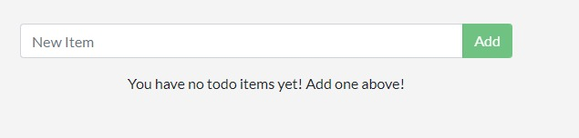

# DOCKER LABS | DOCKER TUTORIAL 101

## Getting Started

1. Login ke
   ```bash
   https://labs.play-with-docker.com/.
   ```

2. Klik add new instance. Akan ada terminal yang muncul.

    

3. Jalankan command ini di terminal
    ```bash
    docker run -dp 80:80 docker/getting-started:pwd
    ```

    

4. Maka bakalan muncul port 80. Klik port tersebut
    
    

5. Port 80 tadi bakalan direct ke halaman tutorial docker yang berisi penjelasan
    
    


## Our Application

6. Lakukan download project yang sudah disediakan untuk dijalankan
    
    

7. Download zip dan drag & drop ke terminal
8. Lakukan kompress zip dengan command:
    ```bash
    unzip app.zip
    ```

9. Pindah dari direktori root ke direktori app
    ```bash
    cd app
    ```
    
10. Buat file baru bernama dockerfile, lalu isi dengan:
    ```bash
    touch dockerfile
    ```

    ```bash
    vi dockerfile
    ```

    ```bash
    FROM node:10-alpine
    WORKDIR /app
    COPY . .
    RUN yarn install --production
    CMD ["node", "/app/src/index.js"]
    ```

11. Build container image-nya dengan
    ```bash
    docker build -t docker-101 .
    ```

    

12. Jalankan container-nya dengan

    ```bash
    docker run -dp 3000:3000 docker-101
    ```

13. Maka tampilannya akan seperti ini

    

## Updating Our App

14. Buka file ini dan lakukan editing di line 56

    ```bash
    ~/app/src/static/js/app.js
    ```

    ```bash
    -                <p className="text-center">No items yet! Add one above!</p>
    +                <p className="text-center">You have no todo items yet! Add one above!</p>
    ```

15. Lakukan build ulang untuk melakukan updating
    ```bash
    docker build -t docker-101 .
    ```

    

16. Jalankan container-nya lagi dengan

    ```bash
    docker run -dp 3000:3000 docker-101
    ```

17. Cek ID containernya dengan

    ```bash
    docker ps
    ```