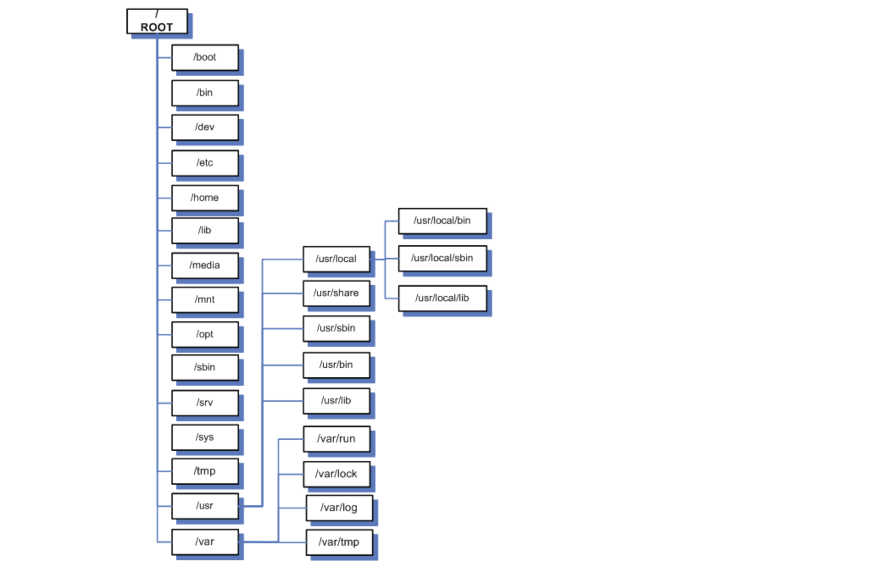
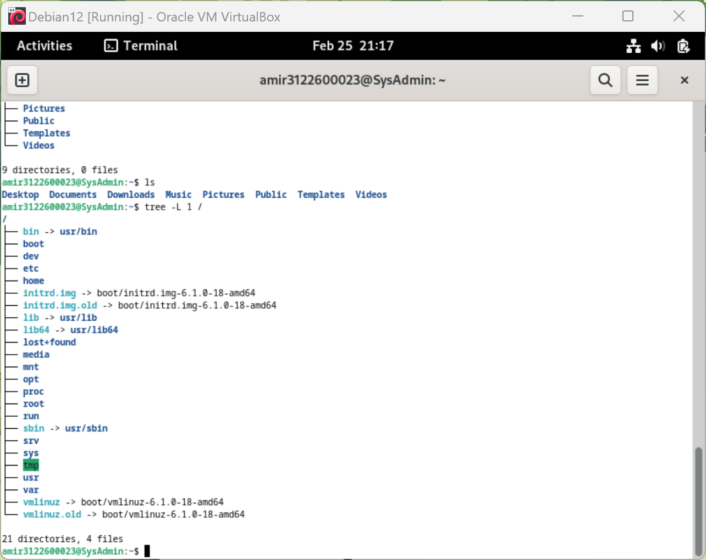
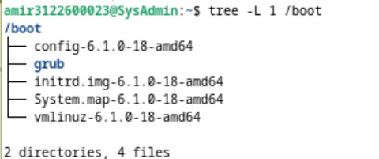

# Linux Directory Structure Overview
 
**The Directory Structure in Unix & Linux** adalah Struktur Direktori terpadu di mana di semua direktori disatukan di bawah sistem file Root "/". Terlepas dari di mana Sistem Berkas dipasang secara fisik, semua direktori disusun secara hierarkis di bawah Root file system.

**The Linux Directory Structure** mengikuti **"Filesystem Hierarchy Structure (FHS)"** yang dikelola oleh Free Standards Group meskipun sebagian besar distribusi terkadang cenderung menyimpang dari standar tersebut.

Mari kita lihat sekilas tentang berbagai direktori yang berbeda di bawah Hirarki Sistem Berkas Linux:

## Root "/"

dimulai dengan sistem file Root "/" dan memang merupakan direktori root untuk seluruh struktur Partisi di mana / (direktori root) akan berada pada sistem yang kompatibel dengan UNIX atau UNIX.

## /Boot

Direktori /boot berisi file-file boot loader termasuk Grub atau Lilo, Kernel, initrd dan file konfigurasi system.map.

*fungsi* : Direktori /boot umumnya digunakan untuk menyimpan file-file yang diperlukan untuk proses booting sistem operasi. Fungsi utamanya adalah menyimpan kernel Linux dan berkas konfigurasi boot seperti GRUB (Grand Unified Bootloader) atau LILO (Linux Loader).

*perbedaan di pisah atau disatukan* : 

**A. Jika /boot dipisahkan dari root file system**, ini bisa memiliki beberapa keuntungan:

1. Keamanan: Memisahkan /boot dari root file system dapat meningkatkan keamanan sistem. Dengan memisahkan /boot, Anda dapat mengenkripsi partisi root tanpa mengganggu proses booting, karena kernel dan file boot yang penting dapat diakses sebelum partisi root di-mount.

2. Pemeliharaan: Memisahkan /boot memudahkan pemeliharaan sistem. Jika Anda perlu menginstal ulang atau memperbarui kernel, Anda dapat melakukannya tanpa khawatir tentang ruang disk yang terbatas di partisi root.

3. Keselamatan: Memisahkan /boot dari root juga dapat memberikan perlindungan tambahan terhadap kesalahan manusia atau serangan berbahaya yang mungkin memengaruhi sistem boot.

Namun, memisahkan /boot dari root juga bisa menambah kompleksitas administratif dan manajemen disk. Jadi, keputusan untuk memisahkan atau tidak memisahkan /boot dari root harus dipertimbangkan berdasarkan kebutuhan dan preferensi spesifik sistem Anda.

**B. Jika direktori /boot tidak dipisahkan dari root file system**, artinya kernel Linux dan file-file boot terkait disimpan di dalam partisi yang sama dengan seluruh sistem operasi. Dalam hal ini, semua file yang diperlukan untuk proses booting, seperti kernel dan konfigurasi bootloader, akan berada di dalam direktori /boot yang terletak di partisi root.

Konsekuensinya adalah sebagai berikut:

1. Ketergantungan pada Partisi Root: Semua file yang diperlukan untuk booting, bersama dengan seluruh sistem operasi, akan terkandung dalam partisi yang sama. Ini berarti bahwa partisi root harus di-mount sebelum sistem dapat melakukan booting dengan benar.

2. Ketidakmampuan Enkripsi: Jika Anda ingin mengenkripsi partisi root untuk meningkatkan keamanan, Anda akan menghadapi tantangan karena kernel dan file boot terletak di dalamnya. Ini dapat mengakibatkan kesulitan dalam menerapkan enkripsi, karena kernel dan file boot perlu diakses untuk proses booting.

3. Manajemen Disk yang Lebih Sederhana: Tanpa pemisahan /boot, manajemen disk dapat menjadi lebih sederhana karena tidak perlu mempertimbangkan alokasi ruang khusus untuk direktori /boot. Ini dapat mempermudah proses instalasi dan pemeliharaan sistem.

4. Rentan terhadap Kesalahan dan Serangan: Jika ada kesalahan pada partisi root atau jika terjadi serangan yang memengaruhi partisi root, ini juga dapat memengaruhi proses booting sistem secara keseluruhan, termasuk akses ke kernel dan file boot yang dibutuhkan.

Secara umum, memisahkan atau tidak memisahkan direktori /boot dari root file system merupakan keputusan desain yang harus dipertimbangkan dengan cermat berdasarkan kebutuhan spesifik dan pertimbangan keamanan serta manajemen sistem.

## /sys
Ini berisi file Kernel, Firmware dan file terkait sistem. Di distribusi Linux seperti Debian, direktori /sys adalah bagian dari sistem file virtual yang digunakan untuk menyediakan akses ke informasi yang berkaitan dengan perangkat keras (hardware) yang terdeteksi oleh kernel Linux. Ini adalah bagian dari "procfs" (sistem file proses) yang digunakan untuk menyediakan informasi tentang status sistem secara dinamis.

