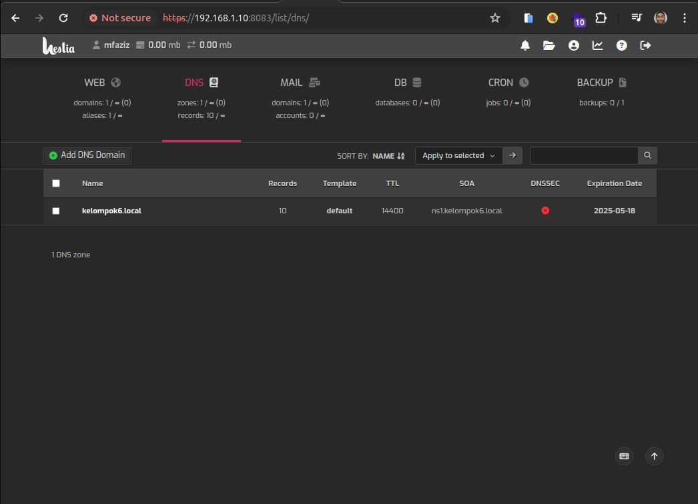

# Hestiacp Installation

## Step 1: Download

Download skrip instalasi untuk rilis terbaru:

```bash
wget https://raw.githubusercontent.com/hestiacp/hestiacp/release/install/hst-install.sh
```

Jika pengunduhan gagal karena kesalahan validasi SSL, pastikan Anda telah menginstal paket ca-certificate di sistem Anda - Anda dapat melakukannya dengan perintah berikut:

```bash
apt-get update && apt-get install ca-certificates
```

## Step 2: Run

Untuk memulai proses instalasi, cukup jalankan skrip dan ikuti petunjuk di layar:

```bash

                _   _           _   _        ____ ____
               | | | | ___  ___| |_(_) __ _ / ___|  _ \
               | |_| |/ _ \/ __| __| |/ _` | |   | |_) |
               |  _  |  __/\__ \ |_| | (_| | |___|  __/
               |_| |_|\___||___/\__|_|\__,_|\____|_|

                          Hestia Control Panel
                                  1.8.11
                            www.hestiacp.com

========================================================================

Thank you for downloading Hestia Control Panel! In a few moments,
we will begin installing the following components on your server:

   - NGINX Web / Proxy Server
   - Apache Web Server (as backend)
   - PHP-FPM Application Server
   - Bind DNS Server
   - Exim Mail Server + ClamAV + SpamAssassin
   - Dovecot POP3/IMAP Server
   - MariaDB Database Server
   - Vsftpd FTP Server
   - Firewall (iptables) + Fail2Ban Access Monitor

========================================================================


Would you like to continue with the installation? [Y/N]: y

Please use a valid emailadress (ex. info@domain.tld).
Please enter admin email address: aziz@mail.kelompok6.local
Please enter FQDN hostname [hestiacp.myguest.virtualbox.org]: hestiacp.kelompok6.local
Installation backup directory: /root/hst_install_backups/180520241749
Installation log file: /root/hst_install_backups/hst_install-180520241749.log

Adding required repositories to proceed with installation:

[ * ] NGINX
[ * ] PHP
[ * ] Apache2
[ * ] MariaDB
[ * ] Hestia Control Panel

Extracting templates from packages: 100%lease wait...|
setting xserver-xorg-legacy/xwrapper/allowed_users from configuration file
-
The installer is now downloading and installing all required packages.
NOTE: This process may take 10 to 15 minutes to complete, please wait...
Extracting templates from packages: 100%


========================================================================

[ * ] Configuring system settings...
[ * ] Configuring Hestia Control Panel...
[ * ] Configuring OpenSSL to improve TLS performance...
[ * ] Generating default self-signed SSL certificate...
[ * ] Adding SSL certificate to Hestia Control Panel...
[ * ] Enabling SFTP jail...
[ * ] Creating default admin account...
[ * ] Configuring NGINX...
[ * ] Updating Cloudflare IP Ranges for Nginx...
[ * ] Configuring Apache Web Server...
[ * ] Installing PHP 8.2...
[ * ] Configuring PHP-FPM 8.2...
[ * ] Configuring PHP...
[ * ] Configuring Vsftpd server...
[ * ] Configuring MariaDB database server...
[ * ] Installing phpMyAdmin version v5.2.1...
[ * ] Configuring Bind DNS server...
[ * ] Configuring Exim mail server...
[ * ] Configuring Dovecot POP/IMAP mail server...
[ * ] Installing ClamAV anti-virus definitions...
[ * ] Configuring SpamAssassin...
[ * ] Configuring fail2ban access monitor...
[ * ] Installing Roundcube...
[ * ] Configuring File Manager...
[ * ] Configuring PHP dependencies...
[ * ] Installing Rclone...
[ * ] Configuring System IP...
[ * ] Installing remaining software updates...
[ * ] Updating configuration files...
[ ! ] Adding missing variable to hestia.conf: ENFORCE_SUBDOMAIN_OWNERSHIP ('yes')
[ ! ] Adding missing variable to hestia.conf: DEBUG_MODE ('false')
[ ! ] Adding missing variable to hestia.conf: PLUGIN_APP_INSTALLER ('true')
[ ! ] Adding missing variable to hestia.conf: POLICY_SYSTEM_ENABLE_BACON ('false')
[ ! ] Adding missing variable to hestia.conf: POLICY_SYSTEM_HIDE_SERVICES ('no')
[ ! ] Adding missing variable to hestia.conf: POLICY_SYSTEM_PASSWORD_RESET ('no')
[ ! ] Adding missing variable to hestia.conf: POLICY_USER_CHANGE_THEME ('yes')
[ ! ] Adding missing variable to hestia.conf: POLICY_USER_DELETE_LOGS ('yes')
[ ! ] Adding missing variable to hestia.conf: POLICY_USER_EDIT_DETAILS ('yes')
[ ! ] Adding missing variable to hestia.conf: POLICY_USER_EDIT_DNS_TEMPLATES ('yes')
[ ! ] Adding missing variable to hestia.conf: POLICY_USER_EDIT_WEB_TEMPLATES ('yes')
[ ! ] Adding missing variable to hestia.conf: POLICY_USER_VIEW_LOGS ('yes')
[ ! ] Adding missing variable to hestia.conf: POLICY_USER_VIEW_SUSPENDED ('no')
[ ! ] Adding missing variable to hestia.conf: PHPMYADMIN_KEY ('')
[ ! ] Adding missing variable to hestia.conf: USE_SERVER_SMTP ('')
[ ! ] Adding missing variable to hestia.conf: SERVER_SMTP_PORT ('')
[ ! ] Adding missing variable to hestia.conf: SERVER_SMTP_SECURITY ('')
[ ! ] Adding missing variable to hestia.conf: SERVER_SMTP_USER ('')
[ ! ] Adding missing variable to hestia.conf: SERVER_SMTP_PASSWD ('')
[ ! ] Adding missing variable to hestia.conf: SERVER_SMTP_ADDR ('')
[ ! ] Adding missing variable to hestia.conf: POLICY_CSRF_STRICTNESS ('')
[ ! ] Adding missing variable to hestia.conf: DNS_CLUSTER_SYSTEM ('hestia')
[ ! ] Adding missing variable to hestia.conf: DISABLE_IP_CHECK ('no')
[ ! ] Adding missing variable to hestia.conf: APP_NAME ('Hestia Control Panel')
[ ! ] Adding missing variable to hestia.conf: FROM_NAME ('')
[ ! ] Adding missing variable to hestia.conf: FROM_EMAIL ('')
[ ! ] Adding missing variable to hestia.conf: SUBJECT_EMAIL ('{{subject}}')
[ ! ] Adding missing variable to hestia.conf: TITLE ('{{page}} - {{hostname}} - {{appname}}')
[ ! ] Adding missing variable to hestia.conf: HIDE_DOCS ('no')
[ ! ] Adding missing variable to hestia.conf: POLICY_SYNC_ERROR_DOCUMENTS ('yes')
[ ! ] Adding missing variable to hestia.conf: POLICY_SYNC_SKELETON ('yes')
[ ! ] Adding missing variable to hestia.conf: POLICY_BACKUP_SUSPENDED_USERS ('no')
[ ! ] Adding missing variable to hestia.conf: DOMAINDIR_WRITABLE ('no')


====================================================================


Congratulations!

You have successfully installed Hestia Control Panel on your server.

Ready to get started? Log in using the following credentials:

	Admin URL:  https://hestiacp.kelompok6.local:8083
	Backup URL: https://114.5.16.127:8083
 	Username:   admin
	Password:   LE95vsuobrqdP3sc

Thank you for choosing Hestia Control Panel to power your full stack web server,
we hope that you enjoy using it as much as we do!

Please feel free to contact us at any time if you have any questions,
or if you encounter any bugs or problems:

Documentation:  https://docs.hestiacp.com/
Forum:          https://forum.hestiacp.com/
GitHub:         https://www.github.com/hestiacp/hestiacp

Note: Automatic updates are enabled by default. If you would like to disable them,
please log in and navigate to Server > Updates to turn them off.

Help support the Hestia Control Panel project by donating via PayPal:
https://www.hestiacp.com/donate

--
Sincerely yours,
The Hestia Control Panel development team

Made with love & pride by the open-source community around the world.
[ ! ] IMPORTANT: The system will now reboot to complete the installation process.
Press any key to continue
```

## Step 3: Akses Control Panel

Untuk mengakses control panel, kunjungi https://vm.ip.address:8083, kurang lebih tampilan setelah login akan seperti berikut:


