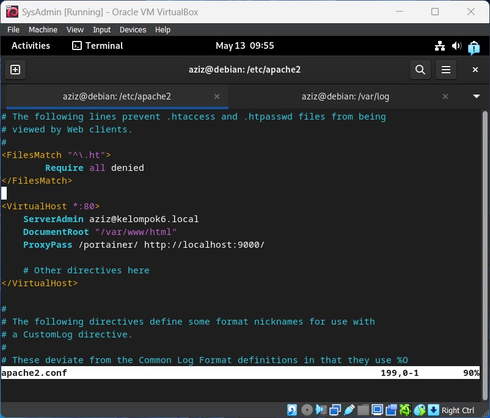
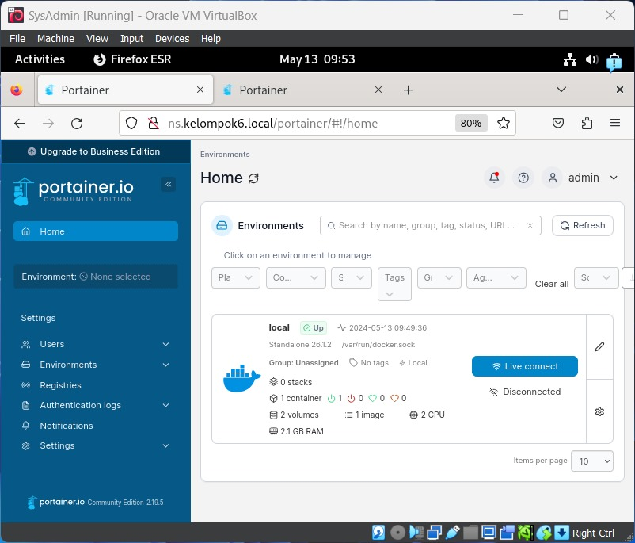

# Setup Reverse Proxy dengan Portainer

### Langkah 1: _Install [Docker](https://docs.docker.com/engine/install/debian/)_

### Langkah 2: Pull docker portainer

```
docker pull portainer/portainer-ce
```

### Langkah 3: run Container Portainer

```
docker run -d -p 8000:8000 -p 9443:9443 --name portainer --restart=always -v /var/run/docker.sock:/var/run/docker.sock -v portainer_data:/data portainer/portainer-ce:latest
```

### Langkah 4: Ganti apache2.conf



```
<FileMatch "^\.ht">
    Require all denied
</FileMatch>

<VirtualHost *:80>
    ServerAdmin aziz@kelompok6.local
    DocumentRoot "/var/www/html"
    ProxyPass /portainer/ http://localhost:900/
</VirtualHost>
```

### Langkah 5: Restart Apache

```
systemctl restart apache2
```

### Langkah 6: Restart Container

```
docker restart portainer
```

### Langkah 7: Portainer sudah bisa ditampilkan di ns.kelompok6.local


